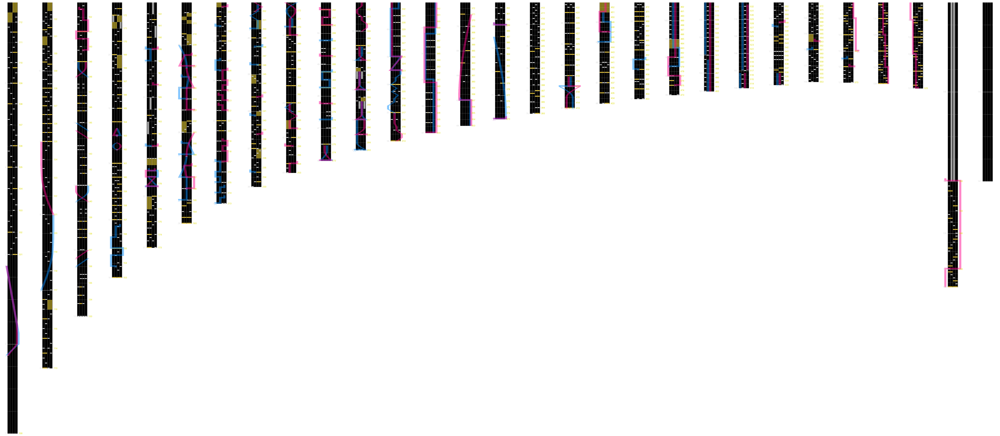

# VOX Visualizer

Renders VOX chart files into columnar PNG images.

## C Implementation (recommended – fast)

The primary implementation is a standalone C program. It requires only a C99
compiler and `libm` (math library, standard on all POSIX systems). A TrueType
font is searched for automatically on the system path for text labels; if none
is found the chart content is still rendered correctly without labels.

### Build

```bash
make
```

This produces the `vox_visualizer` binary in the repository root.

To override the compiler or flags:

```bash
make CC=gcc CFLAGS="-O3 -march=native"
```

### Usage

```bash
./vox_visualizer <input.vox> [output.png] [options]
```

If `output.png` is omitted, the output defaults to `<input_stem>.png` in the same directory.

#### Options

| Option | Default | Description |
| --- | --- | --- |
| `input` | (required) | Path to a `.vox` chart file |
| `output` | `<input_stem>.png` | Output PNG path |
| `--start-measure N` | `1` | First measure to render (1-based) |
| `--end-measure N` | end of chart | Last measure to render |
| `--measures-per-column N` | `5` | Number of measures per column |
| `--column-gap N` | `80` | Horizontal gap between columns in pixels |
| `--font PATH` | (auto-detected) | Path to a TrueType font file for labels |

#### Examples

```bash
# Basic usage, output to default path
./vox_visualizer chart.vox

# Specify output path
./vox_visualizer chart.vox output.png

# Render only measures 10 through 30
./vox_visualizer chart.vox output.png --start-measure 10 --end-measure 30

# 6 measures per column, 40px gap
./vox_visualizer chart.vox output.png --measures-per-column 6 --column-gap 40

# Provide a specific TrueType font
./vox_visualizer chart.vox --font /path/to/font.ttf
```

### Font Support

The C implementation uses [stb_truetype](https://github.com/nothings/stb) (included in `vendor/`) for text rendering. It searches the following paths automatically:

- `/usr/share/fonts/truetype/dejavu/DejaVuSans.ttf`
- `/usr/share/fonts/dejavu/DejaVuSans.ttf`
- `/usr/share/fonts/TTF/DejaVuSans.ttf`
- `/usr/share/fonts/truetype/liberation/LiberationSans-Regular.ttf`
- `/usr/share/fonts/liberation/LiberationSans-Regular.ttf`
- `/usr/share/fonts/truetype/ubuntu/Ubuntu-R.ttf`

If no font is found, measure numbers and BPM labels are omitted but all chart
content (lanes, notes, lasers, grid lines) is rendered normally.

### Dependencies

- C99 compiler (gcc, clang, etc.)
- `libm` (standard on Linux/macOS)
- `vendor/stb_image_write.h` and `vendor/stb_truetype.h` (included, public domain)

---

## Python Implementation (legacy)

The original Python implementation is still available.

### Dependencies

- Python 3.10+
- Pillow

```bash
pip install pillow
```

### Usage

```bash
python cli.py <input.vox> [output.png] [options]
```

#### Options

| Option | Default | Description |
| --- | --- | --- |
| `input` | (required) | Path to a `.vox` chart file |
| `output` | `<input>_columns.png` | Output PNG path |
| `--start-measure` | `1` | First measure to render (1-based) |
| `--end-measure` | end of chart | Last measure to render |
| `--measures-per-column` | `5` | Number of measures per column |
| `--column-gap` | `80` | Horizontal gap between columns in pixels |

---

## Example Output

```bash
./vox_visualizer example/1.vox
```

